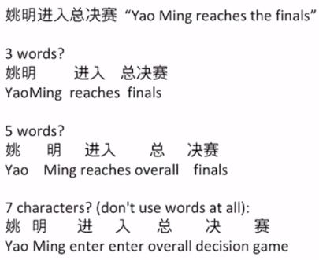

# 15 Mon

## \[AI 스쿨 1기\] 10주차 DAY 1

### NLP : 텍스트 전처리 I ~ II

자연어 처리

* 자연어의 의미를 컴퓨터로 분석해서 특정 작업을 위해 사용할 수 있도록 하는 것
* 응용 분야
  * 기계 번역
  * 감성 분석
  * 문서 분류
  * 질의 응답
  * 챗봇
  * 언어 생성
  * 음성 인식
  * 추천 시스템

단어

* 문장을 구성하는 단어의 갯수
  * 문장부호를 단어로 고려해야 하는가 =&gt; 상황마다 다름
* 구어체 문장의 경우
  * i do _uh main_ mainly business data processing
  * 한번 더듬는 경우
    * Fragments\(깨어진 단어\) : main-
    * filled pauses : uh, um
* 표제어와 단어형태
  * 표제어\(lemma\) : 여러 단어들이 공유하는 뿌리단어
  * 단어형태\(wordform\) : 같은 표제어를 공유하지만 다양한 형태를 가질 수 있음
  * cat과 cats가 예
* 그 외
  * Vocabulary : 단어의 집합
  * Type : Vocabulary의 한 원소
  * Token : 문장 내에 나타나는 한 단어
  * They picnicked by the pool, then lay back on the grass and looked at the stars
    * 16 tokens
    * 14 types \( 'the' is reduplicated \)

말뭉치

* 하나의 말뭉치\(corpus\)는 대용량의 문서들의 집합
* 말뭉치의 특성은 아래의 요소들에 따라 달라지게 됨
  * 언어
  * 방언
  * 장르
  * 글쓴이의 속성 \(나이, 성별, 인종 등\)
* 다양한 말뭉치에 적용할 수 있는 NLP 알고리즘이 바람직하다

텍스트 정규화

* 모든 자연어 처리는 텍스트 정규화를 필요로 한다
  * 토큰화
  * 단어 정규화
  * 문장 분절화
* Unix 명령으로 간단하게 토큰화 하기
  * tr -sc 'A-Za-z' '\n' &lt; hamlet.txt
* 빈도수로 정렬
  * tr -sc 'A-Za-z' '\n' &lt; hamlet.txt \| sort \| uniq -c \| sort -n -r
* 소문자로 변환해서 정렬
  * tr 'A-Z' a-z' &lt; hamlet. txt \| tr -sc 'a-z' \| sort \| uniq -c \| sort -n -r
* 문제점들
  * 문장부호들을 항상 무시할 수는 없음
    * Ph.D, $12.50, 01/02/2021, www.yahoo.com 등
    * 문장부호가 단어의 의미를 명확하게 하는 경우는 제외시키지 않는 것이 좋다
  * 접어\(clitics\)
    * we're =&gt; we are
  * 여러 개의 단어가 붙어야 의미가 있는 경우
    * New York, rock'n'roll
* 중국어의 경우
  * 중국어는 띄어쓰기가 없음

* 한국어의 경우
  * 토큰화가 복잡함
  * 띄어쓰기가 잘 지켜지지 않고 띄어쓰기가 제대로 되었더라도 한 어절은 하나 이상의 의미 단위들이 있을 수 있다.
  * 형태소
    * 자립형태소 : 명사, 대명사, 부사 등
    * 의존형태소 : 다른 형태소와 결합하여 사용되는 형태소 =&gt; 접사, 어미, 조사 등
    * 단어보다 작은 단위로 토큰화가 필요한다

Subword Tokenization

* 학습데이터에서 보지 못했던 새로운 단어가 나타난다면?
  * 학습데이터 : low, new, newer
  * 테스트데이터 : lower
  * -er, -est 등과 같은 형태소를 분리할 수 있으면 더 좋다.
* Algorithms
  * Byte-Pair Encoding \(BPE\)
  * WordPiece
  * Unigram language modeling
* 두 가지 구성요소
  * Token learner : 말뭉치에서 vocabulary를 만들어 냄
  * Token segmenter : 새로운 문장을 토큰화함

BPE

* Vocabulary를 단일 문자들의 집합으로 초기화한다
* 다음을 반복한다

  * 말뭉치에서 연속적으로 가장 많이 발생하는 두 개의 기호들을 찾는다
  * 두 기호들을 병합하고 새로운 기호로 vocabulary에 추가한다
  * 말뭉치에서 그 두 기호들을 병합된 기호로 모두 교체한다

Wordpiece

* BPE는 빈도수를 사용하지만 Wordpiece는 likelihood를 최대화시키는 쌍을 찾는다
* Corpus C에 대해서 C1과 C2를 생성하고 이에 대해 P\(C\)가 높은 Corpus를 선택한다. 이 P\(C\)는 언어모델로 구하며 이는 다음 시간에 설명
* 확률모델\(언어모델\)을 사용한다. =&gt; 완벽한 언어모델이라고 하기는 어려운 점이 있다
* 학습데이터내의 문장을 관측 확률변수로 정의한다
* Tokenization을 잠재 확률변수로 정의한다
* 데이터의 주변 우도를 최대화시키는 tokenization을 구한다.

단어정규화

* U.S.A / USA / US
* uhhuh / uh-huh
* Fed / fed
* am / is / be/ are

Case folding

* 모든 문자들을 소문자화함
* 일반화를 위해서 사용 =&gt; 학습데이터와 테스트데이터 사이의 불일치 문제에 도움
* 정보검색, 음성인식 등에서 유용
* 감성분석 등의 문서분류에서는 대소문자 구분이 유용할 수 있다

Lemmatization

* 어근을 사용해서 표현

최근 경향

* 단어 정규화가 필요한 근본적인 이유
  * 단어 사이의 유사성을 이해해야하기 때문
  * 정규화를 통해 같은 의미를 가진 여러 형태의 단어들을 하나의 단어로 대응시키기 위함
* 단어를 저차원 밀집 벡터로 대응시킬 수 있다면?
  * 단어임베딩을 사용해서 단어를 표현하게 되면 단어 정규화의 필요성이 줄어들게 된다

  

