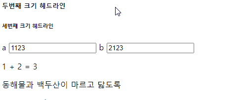

# 프론트엔드 기초다지기 \(HTML, CSS, JS\)

## HTML 기초

Front End

* 사용자 눈에 보이고 만져서 조작하는 부분
* 자동차의 핸들, 브레이크, 좌석 등

Back End

* 사용자 눈에 보이지 않지만 실제 동작을 위한 부분
* 핸들을 돌리면 바퀴가 돌아가는 기능.


실습을 위해 깃허브를 생성한다.


저장소를 다운 할 위치를 설정한다. 본문에서는 `github` 로 폴더를 생성. 나는 `django` 로 생성하겠다. 생성하는 방법은 `mkdir foldername`

* `mkdir foldername` : 입력한 이름을 가진 폴더를 생성한다.
* `cd foldername` : 입력한 이름을 가진 폴더로 현재 디렉토리를 변경한다.


이후, CMDer로 github 페이지를 clone 한다.

`git clone` : github repository를 로컬 저장소로 다운한다.

* github : repository가 저장되어 있는 원격 공간.
* repository : 저장소를 의미하며, 자신이 작업하고자 하는 작업 공간으로 생각해도 된다.

여기서, 나는 HTTP방식이 아닌, SSH 방식으로 clone을 진행할 것이다. HTTP는 `git push` 를 할 때 마다 아이디와 비밀번호를 요구하기 때문. \(전자로 해도 무방하다\)


위와같이 SSH Key가 존재하지 않는다고 뜬다. 이를 위해 CMDer에서 SSH Key를 생성한다. 키 생성 과정은 [여기](https://www.lainyzine.com/ko/article/creating-ssh-key-for-github/)를 참고했다.

1. 기존에 SSH Key가 존재하는지 확인


아무것도 뜨지 않으면 존재하지 않음!


2. SSH Key 생성

```text
ssh-keygen -t ed25519 -C "email@example.com"
```

자신의 이메일로 다음 명령어를 통해 SSH Key를 생성할 수 있다.  `ed25519` 방식으로 동작하지 않는 경우에는 아래와 같이 RSA로 옵션을 변경해 SSH 키를 생성한다.

```text
 ssh-keygen -t rsa -b 4096 -C "your_email@example.com"
```


3. 저장 위치 및 비밀번호 지정

명령어를 입력하면 다음과 같이 저장할 위치와 비밀번호를 물어본다.


그냥 엔터를 누르면 기본 위치에 저장되며 비밀번호 역시 엔터를 누르면서 설정하지 않을 수 있다.

* 깃허브에서는 비밀번호를 설정할 것을 권고한다.

입력하고 나면 다음과 같이 개인키와 공개키가 만들어졌다고 출력된다.


4. 개인키와 공개키 확인

개인키 확인은 다음 명령어를 통해 개인키를 확인할 수 있다. 이는 절대 공개하면 안되는 정보.

```text
$ cat id_ed25519

$ cat C:\Users\32154049/.ssh/id_ed25519
# 내 개인키 실제 위치
```


공개키 확인도 마찬가지로 확인할 수있다.

```text
$ cat id_ed25519.pub

$ cat C:\Users\32154049/.ssh/id_ed25519.pub
# 내 공개키 실제 위치
```


5. 공개키를 Github 계정에 등록

실행한 내용을 직접 복사하기 보다는 명령어로 복사하는 것이 좋다.

```text
# macOS
$ pbcopy < ~/.ssh/id_ed25519.pub

# Windows
$ clip < ~/.ssh/id_ed25519.pub
```

이후, 복사한 공개키를 깃허브에 등록한다.


정상적으로 키가 생성된 모습. 이 키는 공개키이다.


이제 SSH 방식으로 `git clone` 을 해보겠다.


처음과 달리 경고창이 없어진 모습.


성공적으로 Clone 되었다.

 

VSCode에서 본격적으로 html 페이지를 만들어보자.

> index.html

```markup
<!DOCTYPE html>
<html>
    <head>
        <title>상만두의 웹사이트</title>
    </head>
    <body>
        <nav>
            <a href="./index.html">Home</a>
            <a href="./blog_list.html">Blog</a>
            <a href="./about_me.html">About me</a>
        </nav>

        <h1>첫번째 크기 헤드라인</h1>
        <h2>두번째 크기 헤드라인</h2>
        <h3>세번째 크기 헤드라인</h3>
        <h4>첫번째 크기 헤드라인</h4>
        <h5>두번째 크기 헤드라인</h5>
        <h6>세번째 크기 헤드라인</h6>

        <p>동해물과 백두산이 마르고 닳도록</p>
        <a href="https://google.com">Go to google</a>
        
        <hr/>

        
    </body>
</html>
```

&lt;!DOCTYPE html&gt;

* html언어라는 것을 나타내는 약속. 문서 첫 줄에 위치한다.
* &lt;! 만 입력해도 자동완성이 된다.

&lt;html&gt;

* 문서를 이루는 가장 큰 태그

&lt;head&gt;

* 타이틀을 작성할 수 있다

&lt;body&gt;

* 페이지의 내용을 작성할 수 있다

&lt;nav&gt;

* 네비게이션 바를 만들 수 있다.


&lt;h&gt;

* 헤더 태그
* &lt;h1&gt; 부터 &lt;h6&gt; 까지 있으며, 숫자가 작을 수록 글씨가 커진다.

&lt;p&gt;

* 일반 텍스트 태그

&lt;a&gt;

* 링크 등을 삽입할 때 사용한다.

&lt;hr/&gt;

* 수평선을 그을 때 사용한다.
* 닫아주는 태그가 없이 혼자서 사용한다.

&lt;img&gt;

* 이미지를 삽입할 때 사용한다.
* `src = "경로"` 로 이미지 경로를 불러온다.
* `width = "px"` 로 이미지의 가로 길이를 설정할 수 있다.


> about\_me.html

```markup
<!DOCTYPE html>
<html>
    <head>
        <title>상만두의 웹사이트</title>
    </head>
    <body>
        <nav>
            <a href="./index.html">Home</a>
            <a href="./blog_list.html">Blog</a>
            <a href="./about_me.html">About me</a>
        </nav>

        <h1>About me</h1>
        <h2>장고 스터디 상민입니다.</h2>

        <p>HTML, CSS, JS, DJANGO로 웹사이트 만들기</p>
        <p>조성범 멍충이 황인태 바보 오형주 짱</p>
        <a href="index.html">첫 화면으로 가기</a>

        
        
    </body>
</html>
```


## HTML 스타일 입히기

```markup
<nav style="background-color: darkgreen; font-size: 150%; text-align: center; ">
            <a href="./index.html" style="color: white">Home</a>
            <a href="./blog_list.html" style="color: white">Blog</a>
            <a href="./about_me.html" style="color: white">About me</a>
</nav>
```

VSCode의 장점은 자동완성 뿐만 아니라 이런 색 시각화 기능도 제공한다는 것.


`style`

* 태그 안에 입력할 수 있으며 크기나 색, 위치 등을 정의할 수 있다.
  * font-size : 글씨 크기
  * color : 글씨 색깔
  * text-aligh : 정렬

여기서 문제는, 각 태그마다 스타일을 지정해야 한다는 것이다. 50개의 태그가 있으면 50개의 태그 안에 `style` 을 명시해야 한다.

이러한 문제는 `<head>` 태그에 `style` 을 정의함으로써 해결할 수 있다.

```markup
    <head>
        <title>상만두의 웹사이트</title>
        <style>
            nav {background-color: darkgreen; font-size: 150%; text-align: center;}
            nav a {color: gold}
        </style>
    </head>
```


두번째 문제가 있다. 네비게이션 바는 보통 각 페이지마다 동일하다. 따라서 &lt;head&gt; 에서 정의해주는 style을 각 html 파일마다 붙여넣어야 된다는 문제가 있다. html 파일이 100개면 어떻게 할것인가?

이를 CSS 파일을 이용해서 해결한다. 이 부분은 다음 챕터에서 다룬다.


이제 지금까지 작성한 파일을 업로드 하려고 한다.


* `pwd` : 현재 위치하는 디렉토리를 보여준다.
* `cd` : 현재 디렉토리를 변경한다.
  * 이 때, `cd do` 까지만 입력하고 tab을 누르면 디렉토리에 존재하는 파일이나 폴더 이름이 자동완성 된다.
* `ls` : 현재 디렉토리에 있는 파일과 폴더를 보여준다
  * `-A` : 숨김 파일까지 볼 수 있다.


현재는 원격 저장소에 아무 것도 없는 모습. 이제 업로드 시작.


* `git add` : commit할 변경사항\(파일이나 폴더\)들을 등록한다.
  * `git add filename` 으로 등록하며 모든 변경사항을 등록할 때는 `git add .` 로 입력한다.
* `git commit` : add된 변경사항들을 commit 한다.

깃허브에 업로드 하기 위해 `add` -&gt; `commit` -&gt; `push` 단계를 거치는데, 왜 바로 `push` 하지 않고 이러한 단계를 거치는지에 대한 의문점을 가질 수 있다.

간단하게 정리하면 다음과 같다.

* 내가 작성한 모든 파일을 깃허브에 올리고 싶지 않고 선택적으로 올리고 싶기 때문에 `add` 를 사용한다.
* 로컬 저장소에서 내가 작성한 파일을 수정할 때 수정 내용을 메모할 수 있다. 또, 수정 과정을 매번 담을 수 있어서 에러가 났거나 예전 코드로 돌아가야 할 때 백업할 수 있다. 이럴 때 `commit` 을 사용한다. 

원격 저장소에 업로드 된 모습.


## CSS

> practice.css

```css
nav {background-color: darkgreen; font-size: 150%; text-align: center;}
nav a {color: red}
```

css 파일을 만들고, 각각의 html 파일이 css파일을 참조한다고만 명시하면 된다.

```markup
    <head>
        <title>상만두의 웹사이트</title>
        <link href="practice.css" rel="stylesheet" type="text/css">
    </head>
```

이렇게 하면 css 파일만을 수정해도 각각의 html 파일의 스타일이 변경되는 모습을 볼 수 있다.


## JS 기초

자바스크립트는 활용도가 굉장히 높다. 자바스크립트를 사용하려면 head 태그에 script 태그를 추가하면 된다. 우선 이를 활용하기 위해 body 태그에 다음을 추가한다.

```markup
        <label for="inputA">a</label>
        <input id=inputA value=1 onkeyup="doSomething()">

        <label for="inputB">b</label>
        <input id=inputB value=2 onkeyup="doSomething()">
```

&lt;label&gt;

* 간단한 텍스트 상자
* `for` : 지정한 id의 태그와 연결할 수 있다

&lt;input&gt;

* 사용자가 입력할 수 있는 공간
* `id` : id를 설정한다. 태그마다 id가 존재할 수 있으며 이 id는 html 태그 내부에서 유일해야 한다.
* `onkeyup` : 키보드의 키를 누르고 뗄 때 어떠한 동작을 하라는 의미
  * 여기서는 doSomething 이라는 함수가 실행된다.


이후, 스크립트 언어를 작성한다.

```markup
        <script type="text/javascript">
            function doSomething(){
                alert("Hello World!");
            }
        </script>
```

`alert`

* 메시지를 팝업 형태로 출력한다.


```markup
        <script type="text/javascript">
            function doSomething(){
                let a = document.getElementById("inputA").value;
                let b = document.getElementById("inputB").value;
                document.getElementById("valueA").innerHTML = a;
                document.getElementById("valueB").innerHTML = b;
                document.getElementById("valueC").innerHTML = a + b;
            }
        </script>
```

`document`

* 현재 코드가 작성되고 있는 문서를 의미한다.

`getElementById`

* 해당 Id 값에 해당하는 태그의 값을 가져오라는 의미
* 여기에서는 `<input id=inputA" value=1 onkeyup="doSomething()">` 에 있는 value 값을 가지고 오게 된다.

`let a`

* 스크립트에서는 변수 선언을 `let 변수이름` 형태로 한다.

`innerHTML`

* 얻은 요소에 해당하는 값을 바꾸라는 의미이다.
* `document.getElementById("valueA").innerHTML = a;` 여기서는 아이디가 valueA에 해당하는 요소의 값이 a로 변경되게 된다.


여기서 문제가 있는데 바로 마지막 줄 `document.getElementById("valueC").innerHTML = a + b;` 이다. `a+b` 를 string 형태로 보기 때문에 3 + 5 = 8 이 아닌 35로 출력하게 된다. 따라서 형변환을 해줘야 한다.

```javascript
document.getElementById("valueC").innerHTML = Number(a) + Number(b);
```

다음과 같이 입력되는 모습



```markup
        <label for="inputA">a</label>
        <input id=inputA value=1 onkeyup="doSomething()">

        <label for="inputB">b</label>
        <input id=inputB value=2 onkeyup="doSomething()">

        <p>
            <span id="valueA">1</span> + <span id="valueB">2</span> = <span id="valueC">3</span>
        </p>
```

`span`

* 어떤 영역을 지정할 때 사용한다.


또한, 실행이 잘 안될때에는 개발자 도구에서 확인할 수 있다.


코드에서 특정 라인에서 에러가 났다고 출력해주는 모습.


## JS 파일로 관리하기

버튼을 누르면 현재 시간을 알려주는 페이지를 만드려고 한다. 이 때 CSS 파일처럼 JS도 파일로 가지고 있고 HTML 파일에서 불러올 수 있다.

```markup
    <head>
        <title>상만두의 웹사이트</title>
        <link href="practice.css" rel="stylesheet" type="text/css">

        <script type="text/javascript" src="add_two_numbers.js"></script>
        <script type="text/javascript" src="what_time_is_it.js"></script>
        
    </head>
```

> add\_two\_numbers.js

```javascript
function doSomething(){
    let a = document.getElementById("inputA").value;
    let b = document.getElementById("inputB").value;
    document.getElementById("valueA").innerHTML = a;
    document.getElementById("valueB").innerHTML = b;
    document.getElementById("valueC").innerHTML = Number(a) + Number(b);
}
```

> what\_time\_is\_it.js

```javascript
function whatTimeIsIt(){
    alert(new Date())
}
```


