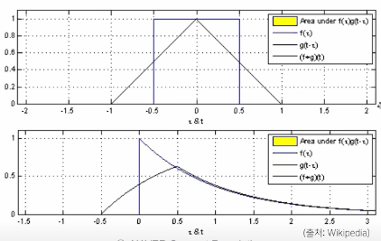

# \(AI Math 9강\) CNN 첫걸음

### Convolution

기존의 신경망\(MLP\)은 각 뉴런들이 선형모델과 활성함수로 모두 연결된\(fully connected\) 구조였다.

* 입력 뉴런 x의 크기만큼 그리고 신경망의 깊이만큼 W의 크기가 커져서 계산해야할 파라미터 수가 너무 많고 시간이 너무 오래걸린다는 이슈가 있었다.

Convolution은 고정된 가중치 행렬인 **커널**을 사용한다. 또, 입력벡터 x를 모두 사용하는 것이 아니라 커널의 크기만큼만 사용하게 된다.

* 입력벡터 x를 한번에 모두 쓰는게 아니라는 뜻이다. 커널이 입력벡터 x 위를 움직이면서 사용하게 된다.
* 중요한 점은 입력벡터 x의 크기와 상관없이 커널의 크기가 고정적이라는 것이다.
* 그래서, 파라미터 수를 많이 줄일 수 있다는 것이 특징이다

Convolution은 두 가지 방식으로 정의할 수 있다.

* 정의역이 연속인 공간에서 적분을 사용
* 정의역이 이산인 공간에서 급수를 사용
* 적분과 급수의 차이만 있을 뿐 그외의 차이는 없다.
* g는 신호, f는 커널을 의미한다.
  * 이러한 커널을 이용하여 신호를 증폭 또는 감소시켜서 정보를 추출 또는 필터링 하는 것이 Conv. 연산의 의미이다.
* 빼기가 아니라 더하기를 사용하기 때문에 엄밀히 말하면 CNN에서 사용하는 연산은 Conv, 가 아니라 cross-correlation이다.
  * 역사적으로 불러왔기 때문에 범용적으로는 Conv. 라고 한다
  * 전체공간에서 봤을 때 Conv. 인지 cross. 인지는 중요하지 않지만 컴퓨터 연산에서는 중요하다.

* 파란색은 신호, 빨간색이 커널이다.
* 노란색은 신호와 커널의 겹치는 면적을 의미하며, 검은색은 이 면적의 넓이\(=결과\)이다.

Conv. 연산은 영상처리에 많이 쓰인다. [여기](https://setosa.io/ev/image-kernels/)서 많은 처리를 해볼 수 있다.

또, 데이터의 종류에 따라 다양한 차원에서 계산이 가능하다.

* 1차원 : 음성
* 2차원 : 이미지
* 3차원 : 동영상

### 2차원 Convolution

2D-Conv는 커널을 입력벡터 상에서 움직여가면서 선형모델과 합성함수가 적용되는 구조이다.

입력 크기가 \(H, W\), 커널 크기가 \($$ K_H $$, $$ K_W$$\), 출력 크기가 \($$O_H$$, $$O_W$$\) 라고 하면 출력 크기는 다음과 같이 계산한다.

* $$O_H = H - K_H + 1$$
* $$O_W = W - K_W + 1$$
* 만약 28x28 입력을 3x3 커널로 연산하면 26x26이 된다.
  * 물론 stride\(이후에 나올 개념\)가 1이라는 가정

또, 채널이 여러개이면 그만큼 커널도 여러개\(채널 수와 동일\)이다.

* 이러한 여러개의 커널들의 쌍을 필터라고 하며, 여러개의 필터를 입력과 Conv 연산을 할 수 있다.

### Convolution 연산의 역전파

Conv도 마찬가지로 선형연산이다. Conv에서 재밌는 점은 Conv를 미분해도 Conv 연산이 나온다는 것이다. 이는 커널이 모든 입력데이터에 공통으로 Conv 연산이 적용되기 때문에 역전파를 계산할 때도 Conv 연산이 나온다.

* 사실 재미는 없다

입력 벡터의 한 원소인 X3를 기준으로 보자

* O1은 X3와 W3의 곱으로 표현되었다\(여기서 표현되었다는 O1을 이루는 원소 중 하나라고 해석하면 된다\)
  * 01 = X1W1 + X2W2 + X3W3
* O2는  X3와 W2의 곱으로 표현되었다
* O3는 X3와 W1의 곱으로 표현되었다.

따라서 이 때의 미분 델타값이 커널을 통해 그레디언트가 전달된다.

이후, 그레디언트 델타와 입력값을 곱한 값이 커널에 전달되어 업데이트가 된다.

X3가 아니라 W1을 기준으로 봤을 때는 위 그림처럼 각각 델타1, 2, 3가 입력 벡터 X1, 2, 3와 곱해져 W1에게 전달된다.

